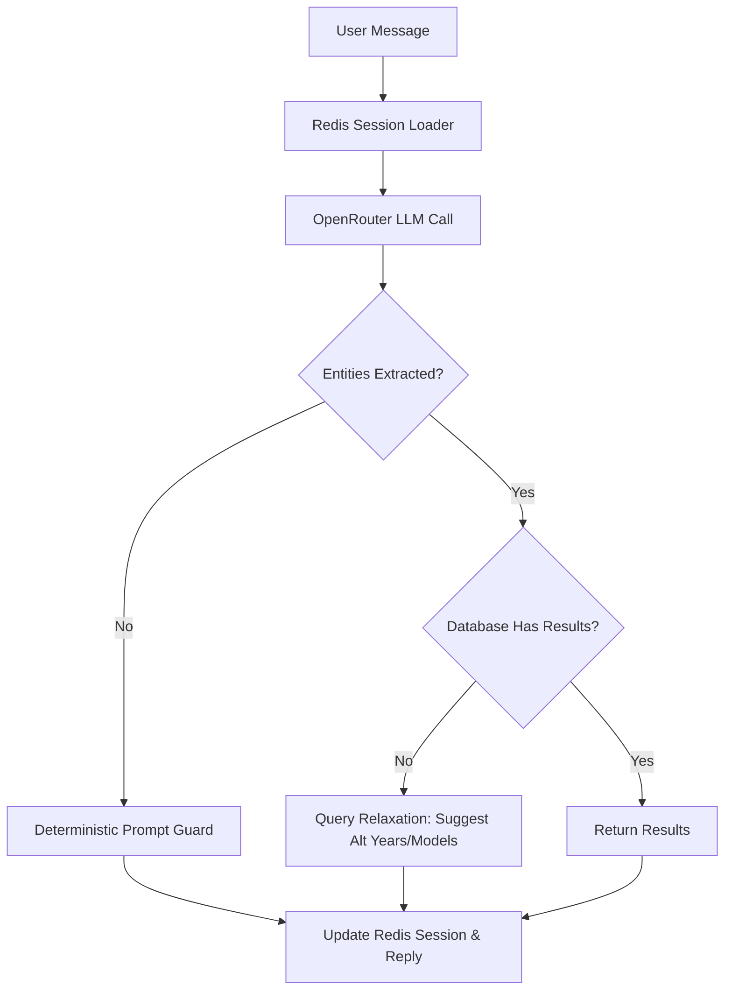

In my recent role, I took over a non-functional, legacy AI-powered car search engine for the Omani used-car market. The system had great ambitions—aggregating tens of thousands of listings and offering a conversational AI interface—but the existing implementation was unstable and prone to crashing. 

Here is how I refactored the backend architecture, stabilized the agent's logic, and built a robust production-ready system.

---

## The Core Architecture

The system coordinates multi-platform scraping, asynchronous processing, and a hybrid AI agent search flow.

---

## 1. Asynchronous Data Pipeline (Celery + Redis)

Scraping sites like Dubizzle and OpenSooq produces raw, unstructured data that is highly volatile. To prevent pipeline blockages, we separate raw data ingestion from validation and model ingestion:

1. **Ingestion:** Raw scrapers fetch page source and save directly to `RawCarData` records.
2. **Asynchronous Processing:** Celery beat triggers batch tasks (`process_raw_car_data_batch_task`) which process raw data in chunks of 50.
3. **Exponential Backoff:** The processor handles custom network/db retries to keep data ingestion robust.

This ensures that scraping failures or target website DOM updates do not block the active database or cause data loss.

---

## 2. The Hybrid Agent State Machine

A pure LLM conversational search is brittle; LLMs often hallucinate filters, lose session states, or fail on shorthand inputs like "S" or "11". We built a **hybrid state machine** that overlays deterministic rules on top of OpenRouter LLM extractions:

* **Redis Caching:** Session state is loaded and saved to Redis (`agent_v2:<conversation_id>`) each turn to track filters.
* **Deterministic Overrides:** Regex guards detect reset phrases (e.g. "something else") or brand switches, resetting search filters immediately.
* **Shorthand Normalization:** Custom token extractors catch single-word inputs (like model families or years) that LLMs typically drop.
* **Entity Validation:** The system guarantees that `brand`, `model`, and `year` are populated before executing queries, intercepting the LLM response to ask for missing required inputs if needed.

---

## 3. Database-Driven Query Relaxation

If a user searches for an exact combination (e.g., `2019 Toyota Camry`) that is out of stock, returning "0 results" leads to high user churn. We implemented a query relaxation layer:

1. **Alternative Years:** If the exact year is missing, the system finds the closest year with active listings (e.g. "I couldn't find a 2019 Camry, showing 2020 instead").
2. **Model Family Options:** If the exact model variant is missing, it lists related models (e.g., searching for "s500" returns S-Class variants).
3. **Conversation State:** A pending suggestion state is held in Redis, enabling the user to confirm with simple phrases like "show them" or "doesn't matter" to execute the relaxed search.

---

## 4. End-to-End Regression Testing

To verify the agent's stability, we built `test_agent.py` containing **59 integration test scenarios** testing:
* Double typos (`toyata camri` -> Toyota Camry).
* Spacing issues (`rav 4` -> RAV4).
* Shorthand variants (`s-500`, `s500`).
* Arabic input processing.
* Meta questions and reset phrasing.

Every deployment run executes this suite to guarantee no conversational regressions occur.
