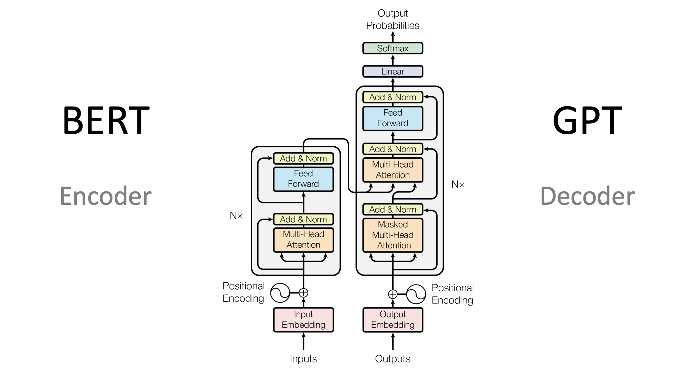
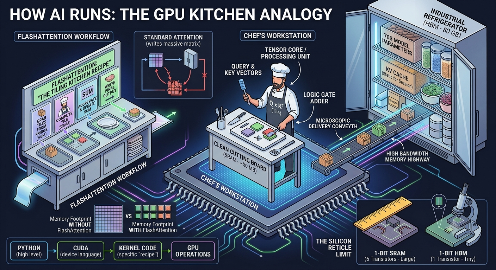

map:
1) hyperparams block
2) data block
	loss tracking function
3) Single Attention Head Class (head_size)
	at first B, T, C = shape
4) head_size = n_embd // num_head
	wei = attention scores matrix


### Qs for recall: 

what's d_head's formula? 
what's wei and its formula? 




### The Big Tensor Shape Correction ($B, T, C$)

- **B = how many independent sequences will we process in parallel?
- **T = block_size = 256 # what is the maximum context length for predictions? (num_tokens_needed_to_predict_the_next)
- **C = channels = block-size = num_features = n_embd
- n_embd = 
- n_head = 
- n_layer = 
When the input $X$ enters `Head.forward(x)`, its shape is $(B, T, C)$ where $C = \text{n\_embd}$.

When you pass it through your $Q, K, V$ linear layers, you project it to a **new channel dimension**, let's call it $D$ ($\text{head\_size}$).

$$\large\text{head\_size} = \frac{\text{n\_embd}}{\text{n\_head}}$$

- $Q(X) \rightarrow (B, T, D)$
    
- $K(X) \rightarrow (B, T, D)$
    
- $V(X) \rightarrow (B, T, D)$

- Your attention score matrix (`wei`) is the dot product of $Q$ and $K^T$. To do this **across batches**, you transpose only the last two dimensions of $K$:

$$\large\text{wei} = Q \cdot K^T \rightarrow (B, T, D) \times (B, D, T) = (B, T, T)$$

- `wei` is $(B, T, T)$. This represents how much every token in the sequence cares about every other token. This is where you apply `torch.tril` and `softmax`.

Finally, you multiply `wei` by $V$:

$$\large\text{out} = \text{wei} \cdot V \rightarrow (B, T, T) \times (B, T, D) = (B, T, D)$$

- **`__init__(self, head_size)`**: This is called _once_ when you create the layer. It defines **what structural components live inside the head** (the weights, matrices, and configuration). It only needs `head_size` because it's just setting up the architecture.
    
- **`forward(self, x)`**: This is called _every single time you pass data_ through the layer during training or inference. **`x` is the actual tensor of data moving through the network.**

### 1. Instantiation (uses __init__)

### 2. Execution (calls forward)

```python
from requests import head
import torch
import torch.nn as nn
from torch.nn import functional as F

# hyperparameters
batch_size = 64 # how many independent sequences will we process in parallel?
block_size = 256 # how many previous tokens are used for predicting the next?
max_iters = 5000
eval_interval = 500
learning_rate = 3e-4
device = 'cuda' if torch.cuda.is_available() else 'cpu'
eval_iters = 200
n_embd = 384
n_head = 6
n_layer = 6
dropout = 0.2
# ------------

torch.manual_seed(1337) # To get the exact same results every time

# wget https://raw.githubusercontent.com/karpathy/char-rnn/master/data/tinyshakespeare/input.txt
with open('input.txt', 'r', encoding='utf-8') as f:
    text = f.read()

# here are all the unique characters that occur in this text
chars = sorted(list(set(text)))
vocab_size = len(chars)
# create a mapping from characters to integers
stoi = { ch:i for i,ch in enumerate(chars) }
itos = { i:ch for i,ch in enumerate(chars) }
encode = lambda s: [stoi[c] for c in s] # encoder: take a string, output a list of integers
decode = lambda l: ''.join([itos[i] for i in l]) # decoder: take a list of integers, output a string
```

```python
# --- EXAMPLE 
input_string = "cat bit the dog" encoded_ints =  encode(input_string) print("Original String:", input_string) print("Encoded Integers:", encoded_ints) ```
```

Output: [28, 26, 45, 0, 27, 34, 45, 0, 45, 33, 30, 0, 29, 40, 32] 

Decoding that list back into a string decoded_string:

```python
decode(encoded_ints) print("Decoded Output :", decoded_string) # Output: "cat bit the dog"```
```

```python
# Train and test splits
data = torch.tensor(encode(text), dtype=torch.long)
n = int(0.9*len(data)) # first 90% will be train, rest val
train_data = data[:n]
val_data = data[n:]

# data loading
def get_batch(split):
    # generate a small batch of data of inputs x and targets y
    data = train_data if split == 'train' else val_data
    ix = torch.randint(len(data) - block_size, (batch_size,))
    x = torch.stack([data[i:i+block_size] for i in ix])
    y = torch.stack([data[i+1:i+block_size+1] for i in ix])
    x, y = x.to(device), y.to(device)
    return x, y

@torch.no_grad()
def estimate_loss():
    out = {}
    model.eval()
    for split in ['train', 'val']:
        losses = torch.zeros(eval_iters)
        for k in range(eval_iters):
            X, Y = get_batch(split)
            logits, loss = model(X, Y)
            losses[k] = loss.item()
        out[split] = losses.mean()
    model.train()
    return out

class Head(nn.Module):
    """ one head of self-attention """

    def __init__(self, head_size):
        super().__init__()
        self.key = nn.Linear(n_embd, head_size, bias=False)
        self.query = nn.Linear(n_embd, head_size, bias=False)
        self.value = nn.Linear(n_embd, head_size, bias=False)
        self.register_buffer('tril', torch.tril(torch.ones(block_size, block_size)))
        self.dropout = nn.Dropout(dropout)

    def forward(self, x):
        # input of size (batch, time-step, channels)
        # output of size (batch, time-step, head size)
        B,T,C = x.shape
        k = self.key(x)   # (B,T,head_size)
        q = self.query(x) # (B,T,head_size)
        # compute attention scores ("affinities")
        wei = q @ k.transpose(-2,-1) * k.shape[-1]**-0.5 # (B, T, head_size) @ (B, head_size, T) -> (B, T, T)
        wei = wei.masked_fill(self.tril[:T, :T] == 0, float('-inf')) # (B, T, T)
        wei = F.softmax(wei, dim=-1) # (B, T, T)
        wei = self.dropout(wei)
        # perform the weighted aggregation of the values
        v = self.value(x) # (B,T,head_size)
        out = wei @ v # (B, T, T) @ (B, T, head_size) -> (B, T, head_size)
        return out

class MultiHeadAttention(nn.Module):
    """ multiple heads of self-attention in parallel """

    def __init__(self, num_heads, head_size):
        super().__init__()
        self.heads = nn.ModuleList([Head(head_size) for _ in range(num_heads)])
        self.proj = nn.Linear(head_size * num_heads, n_embd)
        self.dropout = nn.Dropout(dropout)

    def forward(self, x):
        out = torch.cat([head(x) for head in self.heads], dim=-1)
        out = self.dropout(self.proj(out))
        return out

class FeedFoward(nn.Module):
    """ a simple linear layer followed by a non-linearity """

    def __init__(self, n_embd):
        super().__init__()
        self.net = nn.Sequential(
            nn.Linear(n_embd, 4 * n_embd),
            nn.ReLU(),
            nn.Linear(4 * n_embd, n_embd),
            nn.Dropout(dropout),
        )

    def forward(self, x):
        return self.net(x)

class Block(nn.Module):
    """ Transformer block: communication followed by computation """

    def __init__(self, n_embd, n_head):
        # n_embd: embedding dimension, n_head: the number of heads we'd like
        super().__init__()
        head_size = n_embd // n_head
        self.selfattention = MultiHeadAttention(n_head, head_size)
        self.ffwd = FeedFoward(n_embd)
        self.ln1 = nn.LayerNorm(n_embd)
        self.ln2 = nn.LayerNorm(n_embd)

    def forward(self, x):
        x = x + self.selfattention(self.ln1(x))
        x = x + self.ffwd(self.ln2(x))
        return x

class GPTLanguageModel(nn.Module):

    def __init__(self):
        super().__init__()
        # each token directly reads off the logits for the next token from a lookup table
        self.token_embedding_table = nn.Embedding(vocab_size, n_embd)
        self.position_embedding_table = nn.Embedding(block_size, n_embd)
        self.blocks = nn.Sequential(*[Block(n_embd, n_head=n_head) for _ in range(n_layer)])
        self.ln_f = nn.LayerNorm(n_embd) # final layer norm
        self.lm_head = nn.Linear(n_embd, vocab_size)

        # better init, not covered in the original GPT video, but important, will cover in followup video
        self.apply(self._init_weights)

    def _init_weights(self, module):
        if isinstance(module, nn.Linear):
            torch.nn.init.normal_(module.weight, mean=0.0, std=0.02)
            if module.bias is not None:
                torch.nn.init.zeros_(module.bias)
        elif isinstance(module, nn.Embedding):
            torch.nn.init.normal_(module.weight, mean=0.0, std=0.02)

    def forward(self, idx, targets=None):
        B, T = idx.shape

        # idx and targets are both (B,T) tensor of integers
        tok_emb = self.token_embedding_table(idx) # (B,T,C)
        pos_emb = self.position_embedding_table(torch.arange(T, device=device)) # (T,C)
        x = tok_emb + pos_emb # (B,T,C)
        x = self.blocks(x) # (B,T,C)
        x = self.ln_f(x) # (B,T,C)
        logits = self.lm_head(x) # (B,T,vocab_size)

        if targets is None:
            loss = None
        else:
            B, T, C = logits.shape
            logits = logits.view(B*T, C)
            targets = targets.view(B*T)
            loss = F.cross_entropy(logits, targets)

        return logits, loss

    def generate(self, idx, max_new_tokens):
        # idx is (B, T) array of indices in the current context
        for _ in range(max_new_tokens):
            # crop idx to the last block_size tokens
            idx_cond = idx[:, -block_size:]
            # get the predictions
            logits, loss = self(idx_cond)
            # focus only on the last time step
            logits = logits[:, -1, :] # becomes (B, C)
            # apply softmax to get probabilities
            probs = F.softmax(logits, dim=-1) # (B, C)
            # sample from the distribution
            idx_next = torch.multinomial(probs, num_samples=1) # (B, 1)
            # append sampled index to the running sequence
            idx = torch.cat((idx, idx_next), dim=1) # (B, T+1)
        return idx

model = GPTLanguageModel()
m = model.to(device)
# print the number of parameters in the model
print(sum(p.numel() for p in m.parameters())/1e6, 'M parameters')

# create a PyTorch optimizer
optimizer = torch.optim.AdamW(model.parameters(), lr=learning_rate)

for iter in range(max_iters):

    # every once in a while evaluate the loss on train and val sets
    if iter % eval_interval == 0 or iter == max_iters - 1:
        losses = estimate_loss()
        print(f"step {iter}: train loss {losses['train']:.4f}, val loss {losses['val']:.4f}")

    # sample a batch of data
    xb, yb = get_batch('train')

    # evaluate the loss
    logits, loss = model(xb, yb)
    optimizer.zero_grad(set_to_none=True)
    loss.backward()
    optimizer.step()

# generate from the model
context = torch.zeros((1, 1), dtype=torch.long, device=device)
print(decode(m.generate(context, max_new_tokens=500)[0].tolist()))
#open('more.txt', 'w').write(decode(m.generate(context, max_new_tokens=10000)[0].tolist()))
```
### On why the first class outputs (B, T, head_size)?
$$\large(X, Y) \times (Y, Z) = (X, Z)$$

In the final line of your `Head` forward pass, you have:

$$\large\text{wei} \ (\text{shape: } B, T, T) \quad @ \quad v \ (\text{shape: } B, T, \text{head\_size})$$

PyTorch ignores the batch dimension ($B$) and looks at the last two dimensions:

$$(\large T, \underline{T}) \times (\underline{T}, \text{head\_size}) = (T, \text{head\_size})$$

-  BatchNorm normalizes across the _batch_ dimension.

-  **LayerNorm** normalizes across the **channel dimension (`n_embd`)** for each individual token independently.

-  We have **two** LayerNorms because we have two distinct sub-layers inside the block:

1. `ln1` stabilizes the data _before_ it goes into Attention.
    
2. `ln2` stabilizes the data _after_ attention, right _before_ it goes into the FFN.

### Flash Attention
Standard attention is bottlenecked by the $O(N^2)$ memory bandwidth costs of repeatedly reading and writing the $N \times N$ attention matrix to HBM (High Bandwidth Memory). FlashAttention solves this by fusing the operations and aggressively tiling the computation to keep it entirely within the fast SRAM, completely bypassing the massive I/O overhead.

