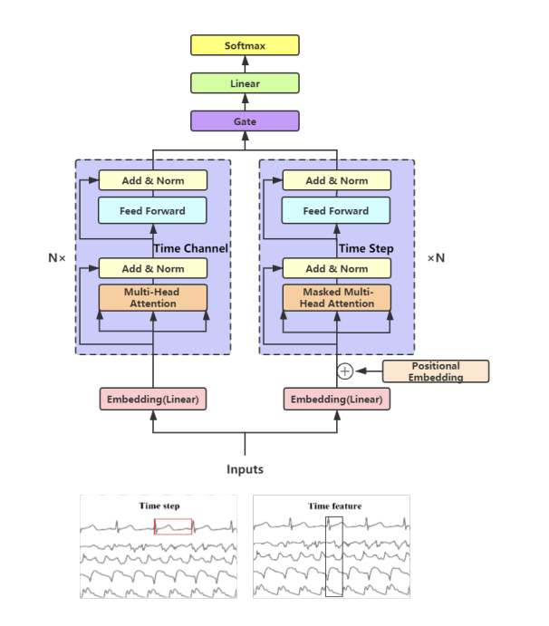

## Content

### Intro - What is it? Briefly
A predictive machine learning system explicitly designed to generate profitable trading signals from high-frequency (1-minute) EUR/USD forex data. The flagship focus of this repository is a custom Double-Tower Gated Transformer Network (GTN) built to predict Take Profit / Stop Loss (TP/SL) strikes.

### How Does it Work? Technical Spec.
The data pipeline processes 1-minute OHLC bars to map out realistic TP/SL bounds over a 24-hour lookahead rather than using fixed time horizons. 
The core model, the **Gated Transformer Network (GTN)**, utilizes a dual-tower architecture that separates feature interactions from temporal sequences. It replaces traditional sinusoidal encodings with learned time embeddings to capture market regime shifts and session overlaps (London, NY, Tokyo). 
To combat severe class imbalance (the model's tendency to constantly predict "keep/hold"), the network optimizes against a custom cost matrix and weighted cross-entropy loss.

### What Sets This Project Apart? 
Instead of optimizing for standard classification accuracy, the pipeline tackles raw profitability. The intent is for models to learn the structural mechanics of price action, balancing Risk/Reward ratios (e.g., 1:2) against real-world MetaTrader 5 execution constraints (enforcing next-candle open entries and proper UTF-16-LE signal formatting).

### Evals and test Series
- **Primary Metric**: Composite Score = `(buy_precision + sell_precision)/2 - 0.25 * |buy_precision - sell_precision|`
- **Best GTN Score**: 0.36 Composite
- **Baseline (LightGBM)**: 0.37 Composite (prone to overfitting the 'keep' class).
- **Status**: The dual-tower architecture maps the feature-space better than tree-based models, but converting high composite scores to live P&L in MT5 remains the primary hurdle.

### Future Dev
find out why despite everything we underfitted? 
I did manage to overfit on a single batch of data; however, based on the scaling laws paper, I tried to do 1 epoch with proportionate maximum parameters that I can efficiently fit into the 80GB VRAM of an A100 GPU or 2*40GB VRAM of A100 depending of availability. 

reference paper: https://arxiv.org/pdf/2103.14438
Gated Transformer Networks for Multivariate Time Series Classification